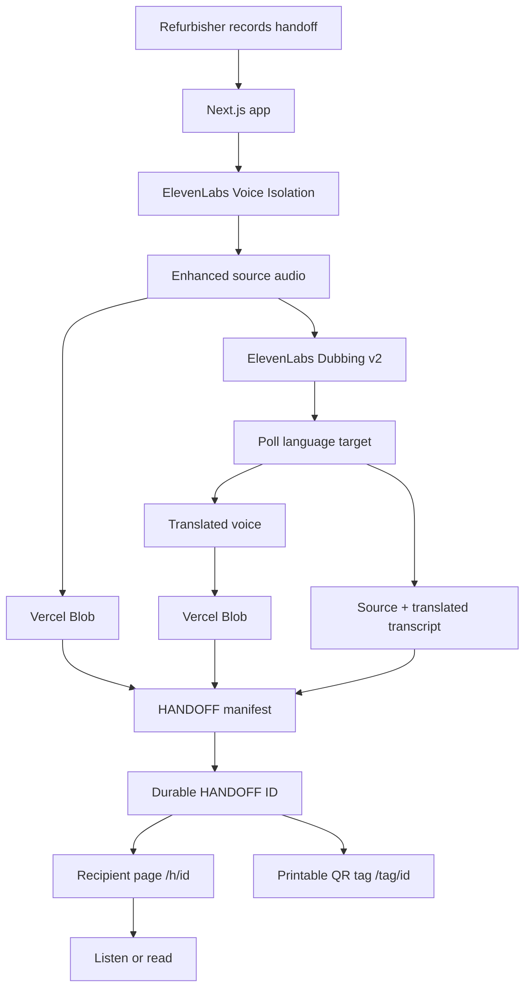

# HANDOFF

### Give the appliance. Pass on the know-how.

**HANDOFF turns a refurbisher's short spoken explanation into an item-specific, bilingual voice-and-text handoff that travels with a donated appliance through a QR tag.**

Built for the **DEV Weekend Challenge: Generosity Edition**  
Primary prize target: **Best Use of ElevenLabs**

> A manufacturer manual knows the model.  
> **HANDOFF knows this specific repaired object.**

---

## Demo

**Live demo:** `PASTE_STABLE_DEMO_URL`

**Verified recipient experience:** `PASTE_STABLE_DEMO_URL/sample`

**Demo video:** `PASTE_VIDEO_URL`

The `/sample` route opens a real HANDOFF previously processed with ElevenLabs so the complete recipient experience remains available for evaluation even if the live API workspace reaches its usage quota.

---

## The problem

When a donated or refurbished appliance changes hands, the appliance travels — but the technician's knowledge often does not.

The person who repaired the item may know:

- what was replaced
- what was tested
- how this particular appliance should be started
- what accessories or hoses are packed with it
- small item-specific details that are not in the manufacturer manual

That knowledge can disappear at delivery, especially when the recipient speaks a different language or needs information in a different format.

A generic manual is **model-specific**.

HANDOFF is **object-specific**.

---

## The solution

A refurbisher records a short handoff after preparing an appliance.

HANDOFF then:

1. cleans the spoken recording with **ElevenLabs Voice Isolation**
2. saves the enhanced original recording
3. creates an English ↔ Spanish voice handoff with **ElevenLabs Dubbing v2**
4. retrieves source and translated text for a readable version
5. stores the completed media persistently
6. creates one durable HANDOFF record
7. generates a QR tag that travels with the appliance
8. opens the recipient experience in the recipient's language first

The recipient can **listen or read** without creating an account.

---

## Who it is for

HANDOFF is designed for workflows involving:

- appliance-refurbishing nonprofits
- repair volunteers
- donation programs
- community organizations
- technicians preparing equipment for a second home
- recipient households that may not share the technician's language

The concept was motivated by real nonprofit workflows such as **Tech Aid for Refugees**, which repairs donated household appliances for refugee families and also recruits translators to support intake and deliveries.

HANDOFF is not intended to replace human translators in every situation. It is designed to reduce the amount of useful, routine item-specific knowledge that gets lost when an object changes hands.

---

## Key features

### 🎙 Item-specific recording

The refurbisher records a short spoken handoff about the actual appliance in front of them — not generic product documentation.

### ✨ Voice cleanup

ElevenLabs Voice Isolation cleans the technician's recording before the handoff is stored and dubbed.

### 🌎 English ↔ Spanish voice handoff

The prototype supports both:

- English → Spanish
- Spanish → English

The language direction is selected before recording.

### 🔊 Bilingual audio

Recipients can hear the recipient-language version first and switch back to the original recording whenever they want.

### 📝 Readable text

The same HANDOFF is available as readable source and translated text.

Changing languages switches **both audio and text together**.

### ♿ Multiple access paths

A recipient does not have to depend on one format.

HANDOFF provides:

- recipient-language audio
- original-language audio
- recipient-language readable text
- original-language readable text

If audio cannot load, readable text remains available.

### 🔗 Durable HANDOFF IDs

Each completed HANDOFF receives one UUID-backed record such as:

```text
/h/6632ae97-e5e7-4287-9bd8-d4f230ac8122
```

The QR points to the HANDOFF record rather than exposing a collection of media URLs in the QR itself.

### 🏷 Printable QR tag

A printable tag can be physically attached to the donated appliance.

The repairer's know-how therefore travels with the gift.

### 🔒 Privacy-conscious workflow

HANDOFF does not require a recipient:

- account
- email
- name
- address
- phone number

The handoff is associated with the appliance rather than a beneficiary profile.

---

## Why ElevenLabs is core to HANDOFF

ElevenLabs is not an ornamental AI integration.

It sits directly in the product's critical path.

### 1. Voice Isolation

The browser recording is sent to the ElevenLabs Voice Isolation API before further processing.

This improves the source recording when a volunteer records in a workshop, garage, warehouse, or other imperfect environment.

### 2. Dubbing v2

The enhanced source recording is sent to the ElevenLabs Dubbing API using `dubbing_v2`.

HANDOFF currently supports:

```text
English → Spanish
Spanish → English
```

The result is a recipient-language **voice handoff**, not only translated text.

### 3. Readable transcript

After dubbing completes, HANDOFF retrieves the language-target transcript and extracts:

- source text
- translated text

Those become the readable counterpart to the audio experience.

### 4. Persistent output

ElevenLabs-generated translated audio is copied into Vercel Blob instead of leaving the QR dependent on a temporary signed output URL.

That makes the recipient experience suitable for a physical tag intended to remain with an appliance.

**Remove ElevenLabs and HANDOFF loses its central multilingual voice-transfer workflow.**

---

## Architecture



### Durable HANDOFF manifest

A completed HANDOFF stores:

```text
id
appliance
sourceLanguage
targetLanguage
originalAudioUrl
translatedAudioUrl
sourceText
translatedText
createdAt
```

The physical QR therefore needs to identify only **one HANDOFF**, not every underlying asset.

---

## Demo workflow

### Creator

1. Enter the appliance name.
2. Choose the technician's speaking language.
3. Record a short item-specific handoff.
4. Review the recording.
5. Create the HANDOFF.
6. HANDOFF cleans, stores, dubs, and prepares readable text.
7. Open the recipient view or printable QR tag.

Example recording:

> We replaced the drain pump. Hold Start for two seconds. The inlet hose is inside the drum.

### Recipient

1. Scan the QR tag.
2. Land directly on the recipient-language version.
3. Listen to the dubbed handoff.
4. Read the same information below.
5. Switch to the original language if desired.

No account or navigation maze is required.

---

## Tech stack

| Layer | Technology |
| --- | --- |
| Framework | Next.js 16 |
| UI | React 19 + TypeScript |
| Styling | Tailwind CSS 4 |
| Voice cleanup | ElevenLabs Voice Isolation |
| Voice translation | ElevenLabs Dubbing v2 |
| Readable handoff | ElevenLabs language-target transcript |
| Persistent media | Vercel Blob |
| Durable record | JSON manifest in Vercel Blob |
| QR generation | `qrcode` |
| Deployment | Vercel |

---

## Local setup

### 1. Clone and install

```bash
git clone https://github.com/mneang/handoff.git
cd handoff
npm install
```

### 2. Configure environment variables

Create `.env.local`:

```bash
ELEVENLABS_API_KEY=your_elevenlabs_api_key
BLOB_READ_WRITE_TOKEN=your_vercel_blob_token
```

When deploying on Vercel, connect a Vercel Blob store to the project so the Blob credentials are available to the application.

Keep `ELEVENLABS_API_KEY` server-side. Do not expose it through a `NEXT_PUBLIC_` variable.

### 3. Run locally

```bash
npm run dev
```

Open:

```text
http://localhost:3000
```

### 4. Production build

```bash
npm run build
```

---

## Generosity and impact

Generosity is not only the moment an object is donated.

It is also the effort someone makes to ensure the next person can actually use it.

A volunteer may spend time repairing, testing, cleaning, and preparing an appliance. HANDOFF preserves a small final piece of that generosity: **the knowledge in the volunteer's head**.

The goal is simple:

> **Do not just give the appliance. Pass on the know-how.**

A successful HANDOFF can reduce:

- knowledge lost between repair and delivery
- routine explanations that need to be repeated
- language friction around basic appliance use
- dependence on one sensory format
- uncertainty about what happened to a specific refurbished item

---

## Design decisions

### Object-specific, not recipient-specific

HANDOFF deliberately attaches knowledge to the appliance rather than building a profile about the person receiving it.

### Recipient language first

The translated version is the default recipient experience rather than making the recipient search for their language.

### Audio and text together

Accessibility is treated as a structural feature.

The handoff does not assume that receiving information means only hearing it or only reading it.

### Durable QR architecture

A QR tag may stay attached to a physical object long after the original API request finishes.

For that reason, HANDOFF persists completed media and gives each handoff one durable record.

### Minimal technician workflow

The technician's fastest interface is often simply speaking.

HANDOFF is designed around:

```text
finish repair → speak → create tag
```

rather than requiring a volunteer to write, translate, format, and print instructions manually.

---

## Limitations

This is a weekend-hackathon prototype, so the scope is deliberately narrow.

- The prototype currently supports English and Spanish.
- Live ElevenLabs generation requires available API quota.
- `/sample` provides a verified ElevenLabs-generated HANDOFF for reliable judging and demonstration.
- Prototype media is stored using public Vercel Blob URLs.
- A production deployment should use private or tokenized storage where appropriate, along with retention and deletion controls.
- HANDOFF does not claim to provide safety-certified technical translations.
- Users should avoid names, addresses, phone numbers, sensitive personal information, and safety-critical repair instructions in recordings.
- The prototype focuses on short handoffs rather than full appliance manuals.

---

## Future roadmap

### More languages

Extend recipient-language support for nonprofit and refugee-support workflows.

### Same-language HANDOFFs

Allow English → English and Spanish → Spanish workflows that use Voice Isolation without unnecessary dubbing.

### Private storage and lifecycle controls

Add tokenized access, retention settings, deletion, and nonprofit-level data policies.

### Nonprofit handoff management

Give organizations a lightweight way to find, reprint, archive, or retire HANDOFF tags.

### Low-bandwidth recipient experience

Explore caching and smaller media variants for recipients with inconsistent connectivity.

### More donated equipment

The HANDOFF model could extend beyond appliances to refurbished computers, mobility equipment, tools, bicycles, or other donated objects where item-specific knowledge matters.

---

## Screenshots

### Creator workflow

> **Screenshot placeholder:** HANDOFF creator page showing appliance, language direction, technician recording, and ElevenLabs workflow.

### Recipient experience

> **Screenshot placeholder:** Recipient-language page showing bilingual controls, audio, and readable handoff.

### Physical QR tag

> **Screenshot placeholder:** Printable HANDOFF QR tag attached to or shown beside an appliance.

---

## Hackathon

**DEV Weekend Challenge: Generosity Edition**

HANDOFF is submitted primarily for:

### Best Use of ElevenLabs

The project uses ElevenLabs for:

- Voice Isolation
- Dubbing v2
- source/translated transcript generation

HANDOFF also aims to demonstrate the broader challenge theme by carrying something intangible — a volunteer's knowledge — along with something tangible they are giving away.

---

## Built during the challenge

HANDOFF was designed and built during the DEV Weekend Challenge submission window.

The project intentionally favors a small, complete workflow over a broad feature set:

```text
record
→ clean
→ dub
→ read
→ attach
→ receive
```

**Give the appliance. Pass on the know-how.**

---

## License

HANDOFF is open source under the [MIT License](LICENSE).

